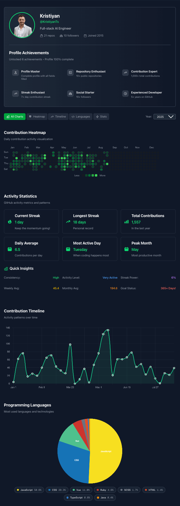

# 🔥 GitHub Activity Tracker

**Break the rules. Own your code. Show your hustle.**

A rebellious developer tool that transforms your GitHub contribution data into stunning visuals for your CV. No more boring tables or text descriptions - let your code speak with killer charts and analytics.

## 🚀 Deploy Your Own Activity Tracker

Ready to deploy this beast? Click the button and show the world your code hustle:

[](https://vercel.com/new/clone?repository-url=https://github.com/kristiyants/github-activity&env=GITHUB_TOKEN&envDescription=GitHub%20Personal%20Access%20Token%20with%20read:user%20and%20repo%20scopes&envLink=https://github.com/settings/tokens)

> **Pro Tip**: You'll need a GitHub Personal Access Token. Get yours [here](https://github.com/settings/tokens) with `read:user` and `repo` scopes.



## 🚀 What This Beast Does

- **Fetch Real Data**: Connect with GitHub API to pull your actual contribution timeline
- **Sick Visualizations**: Generate contribution heatmaps, commit frequency charts, and activity analytics
- **Export Freedom**: Download as JSON for data nerds
- **Multiple Chart Types**: Heatmaps, line charts, bar graphs, and streak analytics
- **CV-Ready**: Export data for your resume
- **Dark Mode First**: Because light mode is for quitters

## 🎯 Features

### Core Functionality
- **GitHub Username Input**: Simple, clean interface to enter any GitHub username
- **Real-Time Data Fetching**: Direct GitHub API integration (no fake data BS)
- **Contribution Analysis**: 
  - Daily commit counts
  - Longest streaks
  - Most active days/months
  - Language breakdown
  - Repository activity

### Export Options
- **JSON Export**: Raw data for developers who want to build their own visualizations
- **PNG/SVG Images**: High-resolution charts perfect for CVs and portfolios
- **Multiple Sizes**: Optimized dimensions for different CV layouts

### Charts & Analytics
- **Contribution Heatmap**: GitHub-style grid showing daily activity
- **Commit Timeline**: Line charts showing activity over time
- **Streak Analysis**: Visualize your longest coding streaks
- **Language Stats**: Breakdown of your most-used programming languages
- **Weekly Patterns**: Discover your most productive days

## 🛠 Tech Stack

- **Next.js 14**: React framework with App Router
- **TypeScript**: Because type safety is rebellion against bugs
- **Tailwind CSS**: Utility-first styling for rapid development
- **Chart.js/Recharts**: Data visualization libraries
- **GitHub API**: Official REST API for contribution data
- **html2canvas**: For generating downloadable images
- **Framer Motion**: Smooth animations and transitions

## 🏃‍♂️ Quick Start

```bash
# Clone the rebellion
git clone https://github.com/KristiyanTs/github-tracker.git
cd github-tracker

# Install dependencies
npm install

# Start the development server
npm run dev

# Open http://localhost:3000 and start tracking
```

## 📋 Environment Setup

Create a `.env.local` file:

```env
GITHUB_TOKEN=your_github_personal_access_token
NEXT_PUBLIC_APP_URL=http://localhost:3000
```

### 🔑 GitHub Token Setup (Required for Real Data)

**CRITICAL**: A GitHub Personal Access Token is **REQUIRED** to fetch real contribution data. Without it, the app will show "data unavailable" messages.

1. Go to [GitHub Settings > Developer settings > Personal access tokens](https://github.com/settings/tokens)
2. Click "Generate new token (classic)"
3. Select the following scopes:
   - `read:user` - Read user profile data
   - `repo` - Access to public and private repositories (for contribution data)
4. Copy the generated token
5. Add it to your `.env.local` file as `GITHUB_TOKEN=your_token_here`

> **Why do we need this?** GitHub's contribution graph data is only available through their GraphQL API, which requires authentication. The REST API doesn't provide this data.

## 🎨 Usage

1. **Enter Username**: Type any GitHub username in the input field
2. **Fetch Data**: Click "Analyze Activity" to pull contribution data
3. **Explore Charts**: View different visualization types
4. **Export**: Download as JSON
5. **Customize**: Adjust date ranges and chart types
6. **Use in CV**: Add exported data to your resume

## 🔧 API Endpoints

```
GET /api/github/[username]
- Fetches user contribution data
- Returns: contribution counts, streaks, repository info

GET /api/github/[username]/languages
- Fetches language statistics
- Returns: language breakdown with percentages
```

## 🎯 Roadmap

- [ ] **Advanced Analytics**: Repository stars, PRs, issues breakdown
- [ ] **Team Analytics**: Compare multiple developers
- [ ] **Custom Themes**: Additional color schemes and styles
- [ ] **Integration APIs**: Direct export to portfolio sites
- [ ] **Mobile App**: React Native version for on-the-go tracking
- [ ] **PDF Reports**: Comprehensive activity reports

## 🤝 Contributing

This project thrives on rebellion against boring developer tools. Contributions welcome!

1. Fork the repository
2. Create your feature branch: `git checkout -b feature/badass-feature`
3. Commit your changes: `git commit -m 'Add badass feature'`
4. Push to the branch: `git push origin feature/badass-feature`
5. Open a Pull Request

## 📄 License

MIT License - Use it, break it, rebuild it. Make it yours.

## ⚡ Performance

- **Fast API Calls**: Optimized GitHub API requests with caching
- **Lazy Loading**: Charts load only when needed
- **Responsive Design**: Works on all screen sizes
- **Minimal Bundle**: Optimized build size under 500KB

## 🐛 Known Issues

- GitHub API rate limits may affect frequent usage (solved with authentication)
- Large contribution histories may take longer to process
- Some private repository data won't be accessible (GitHub API limitation)

---

**Built by developers, for developers. Because your code deserves to be seen.**

🔗 [Live Demo](https://github-tracker.vercel.app) | 📧 [Report Issues](https://github.com/KristiyanTs/github-tracker/issues) | 🌟 [Star if you're badass](https://github.com/KristiyanTs/github-tracker)
